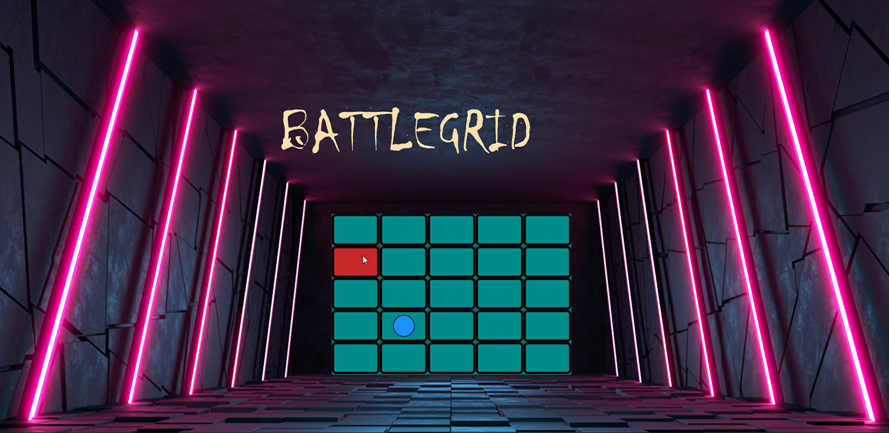

## CombiGame – JavaFX Combinatorial Grid Game

CombiGame is a JavaFX-based combinatorial game where players move a ball on a 5×5 grid under simple but strict rules. You can play **against a computer** or **against another human**, with polished visuals, sound effects, and animated instructions.

---

### Features

- **5×5 BattleGrid**
  - A ball starts at the **bottom-left** cell.
  - Players move the ball **upwards**, **rightwards**, or **diagonally up-right**.

- **Two Game Modes**
  - **Single Player**: Play against a computer opponent with a deterministic endgame strategy and random move selection elsewhere.
  - **Two Player (Local)**: Two human players share the same device and take turns.

- **Toss & Turn Selection**
  - Animated **coin toss** (with 3D rotation) decides who wins the toss.
  - Toss winner chooses to **move first or second**.

- **Win/Loss Conditions**
  - The **top-right** cell of the grid is the “target”.
  - The player who **cannot make a legal move** loses.
  - In practice, whoever moves the ball to the **top-right cell** wins.

- **Polished UI & UX**
  - Built with **JavaFX** and **FXML**.
  - Animated labels (fade, translate), typewriter-style instructions, and coin-spin animation.
  - Background music and sound effects (`bgm.mp3`, `button.mp3`, `finish.mp3`, `type.mp3`).

- **About & Feedback Screen**
  - “About” section with typewriter description of the project.
  - Simple **review form** that appends feedback to `Public_Review.txt` in the project root.

- **Extensible Design**
  - Separate controllers for each screen.
  - Early placeholder/support for an additional game type (**Sequential Nim**, currently marked as “coming soon”).

---

### Game Rules

#### Grid & Moves

- The game is played on a **5×5 grid**.
- The ball starts at the **bottom-left** cell.
- On your turn, you may move the ball:
  - Any number of cells **upwards** (same column, lower row index),
  - Any number of cells **rightwards** (same row, higher column index), or
  - A combination of both (i.e., **diagonally up-right**) in a single move.
- You may **not**:
  - Move left or down.
  - Stay on the same cell (at least one coordinate must change).
  - Make moves that break the monotone “towards top-right” constraints enforced by the game (illegal moves trigger an error dialog).

#### Winning

- The **top-right** cell is effectively the terminal winning position.
- If you move the ball there, your **opponent has no legal moves** and **loses**.
- In single-player:
  - If you reach the top-right first → **“You Won!”**.
  - If the computer reaches it first → **“Computer Won!”**.
- In two-player:
  - The player who reaches the top-right first is declared the winner; the other gets a **“Better luck next time”** message.

#### Toss & Turn Order

- Before gameplay, there is an animated **coin toss**:
  - Single player:
    - You call **HEADS** or **TAILS**, spin the coin, and if you win you choose to move **first** or **second**.
    - If you lose, the computer randomly decides to move first or second.
  - Double player:
    - One player is randomly chosen as **caller** and the other as **spinner**.
    - The caller picks heads/tails, the spinner spins the coin.
    - The toss winner then chooses to move first or second.
- Internally, a turn index (`jitse`) tracks whose turn it is (player/computer, or which human player).

---

### Project Structure

- **Language & Framework**
  - Java (Object-Oriented Programming).
  - JavaFX (controls, FXML, media, animations).

- **Module**
  - `module-info.java` defines module `Game`, requiring:
    - `javafx.controls`
    - `javafx.fxml`
    - `javafx.media`
    - `javafx.graphics`
    - `javafx.base`
  - The `application` package is opened to JavaFX for FXML loading.

- **Key Classes (in `src/application`)**
  - **Entry Point**
    - `Main`: Launches the JavaFX application, starts looping background music, and loads `Home.fxml`.
  - **Navigation & Menus**
    - `HomeController`: Main menu (Start, Sound, About, Exit) with animated welcome text.
    - `soundController`: Toggles global background music on/off.
    - `chooseGameController`: Lets the user choose between **Grid Game** and **Sequential Nim** (the latter is currently not implemented and shows an info alert).
    - `aboutController`: Displays project description via typewriter animation and collects optional player reviews to `Public_Review.txt`.
  - **Grid Game – Mode Selection & Player Info**
    - `gridSingleMultiController`: Chooses between **Single Player** and **Double Player** grid mode.
    - `doublePlayerInfoController`: Collects two player names and passes them forward for double-player mode.
  - **Grid Game – Instructions & Toss**
    - `gridSingleInstructionsController`: Animated rule explanation + coin toss for single-player mode.
    - `gridDoubleInstructionsController`: Similar to single-player, but tailored to two named players and uses a caller/spinner mechanic.
  - **Grid Game – Gameplay**
    - `gridSingleGamePlayController`: Core single-player game logic:
      - Manages ball position on a `GridPane`, validates human moves, enforces rules, triggers a countdown before the computer moves, and controls simple AI behavior.
    - `gridDoubleGamePlayController`: Core two-player grid logic:
      - Same movement rules, but alternates between two human players with a short countdown and an **undo** window.
  - **Result Screens**
    - `lastController`: Single-player result screen (You vs Computer).
    - `lastDoubleController`: Double-player result screen (player vs player).
  - **Utility / Placeholder**
    - `gsmControllers`: Currently an empty class, left as a placeholder for possible shared grid/sound/menu logic.

- **Resources**
  - `application/*.fxml`: Views for each screen (home, choose game, sound settings, instructions, gameplay, results, about, etc.).
  - CSS stylesheets for various screens and dialogs (including `alert.css`).
  - Images for backgrounds, icons, and game art.
  - Audio files: `bgm.mp3`, `button.mp3`, `finish.mp3`, `type.mp3`.

---

### Installation & Setup

#### Prerequisites

- **Java**: JDK 11+ (JavaFX-compatible; JDK 17 is commonly used).
- **JavaFX SDK**: If not bundled with your JDK, you will need a standalone JavaFX SDK and configure it in your IDE/run configuration.
- **IDE**: The project was originally built with **Eclipse** and uses `.project` / `.classpath` files, but any IDE that supports JavaFX will work (IntelliJ IDEA, VS Code with proper plugins, etc.).

#### Importing into Eclipse

1. **Clone the repository**:

   ```bash
   git clone https://github.com/<your-username>/CombiGame.git
   cd CombiGame
   ```

2. **Import as an existing project** in Eclipse:
   - `File` → `Import...` → `Existing Projects into Workspace`.
   - Select the `CombiGame` directory.
   - Finish the import.

3. **Configure JavaFX libraries** (if needed):
   - Ensure the JavaFX `.jar` files (for example, `javafx.controls.jar`, `javafx.fxml.jar`, `javafx.media.jar`) are on the module path/build path.
   - Configure run arguments with the required JavaFX modules if using a standalone JDK (for example, `--module-path` and `--add-modules javafx.controls,javafx.fxml,javafx.media,javafx.graphics`), depending on your environment.

---

### Running the Game

#### From IDE (recommended)

1. Open the project in your IDE.
2. Ensure JavaFX is correctly configured (module path / VM options as required by your setup).
3. Run `Main` (class `application.Main`) as a **Java Application**.
4. The home screen will appear with background music and navigation buttons.

#### From Command Line (example)

If you have JavaFX installed separately and are using JDK 11+ without bundled JavaFX, a generic run command could look like:

```bash
java --module-path /path/to/javafx-sdk/lib \
     --add-modules javafx.controls,javafx.fxml,javafx.media,javafx.graphics \
     -m Game/application.Main
```

Adjust `--module-path` to your JavaFX installation and the module name (`Game`) if you change `module-info.java`.

---

### How to Play

1. **Start the Game**
   - Launch the app; from the home screen, click **Start**.
2. **Choose Game Type**
   - Select **Grid Game** (implemented) or **Sequential Nim** (currently unavailable; shows an info alert).
3. **Choose Mode**
   - In grid mode, select **Single Player** or **Double Player**.
4. **Name Players (Double Player)**
   - Enter both player names and continue.
5. **Read or Skip Instructions**
   - An instruction screen explains the rules with a typewriter effect.
   - You can **Skip** to jump straight to the toss.
6. **Coin Toss**
   - Choose **HEADS** or **TAILS** and click **Spin**.
   - The coin spins and the winner chooses to move **first** or **second**.
7. **Gameplay**
   - Click on grid cells to move the ball according to the rules.
   - Illegal moves will pop up an error dialog.
   - In single-player, after your move there is a short countdown before the computer moves.
   - In both modes, an **Undo** button is available briefly after a move (before the countdown ends).
8. **Winning**
   - If you or your opponent move the ball to the **top-right** cell, a result screen appears with winner-specific messages and options to return home or exit.

---

### Known Limitations & Future Work

- **Sequential Nim**
  - The **Sequential Nim** option in the game selection menu is intentionally disabled and currently shows a “feature unavailable” alert.
  - This is a placeholder for adding another combinatorial game mode in the future.

- **Static State Sharing**
  - Some cross-screen state (like player names, winners, and music state) is shared via `static` fields; a more scalable architecture could use a dedicated game state manager or dependency injection.

- **Single AI Strategy**
  - The computer opponent for the grid game uses a mix of deterministic finishing strategy (force top-right when possible) and random move selection otherwise; it is not an optimal solver for the full combinatorial game space.

---

### Screenshots

You can add screenshots or GIFs here after capturing them from the running app, for example:

- Home screen with animated welcome label.
- Game selection screen (Grid vs Sequential Nim).
- Single-player instructions and coin toss.
- Active BATTLEGRID gameplay (single player and double player).
- Result screens for both modes.

---

### Gameplay Video

[](assets/combigame-gameplay.mp4)

---

### Acknowledgements

- **Coursework Project**: Developed as part of an **Object Oriented Programming Language** course at **Shahjalal University of Science and Technology (SUST)**.
- **Advisor**: Guided by **Mr. Eamin Rahman**, faculty member of the Computer Science department.
- Built with **Java** and **JavaFX**, including FXML, CSS, and JavaFX media & animation APIs.

---

### Contact / Feedback

If you have suggestions, spot a bug, or want to discuss the combinatorial aspects of the game, feel free to open an issue or submit a pull request.

